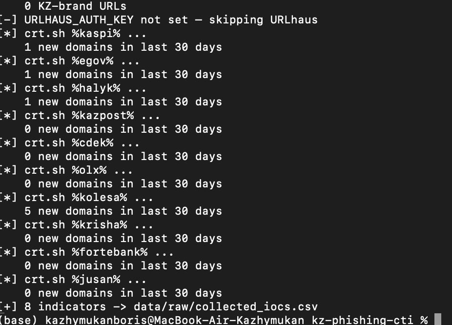
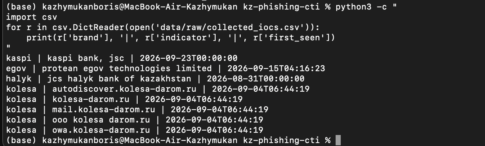
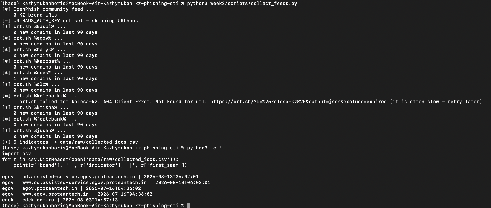
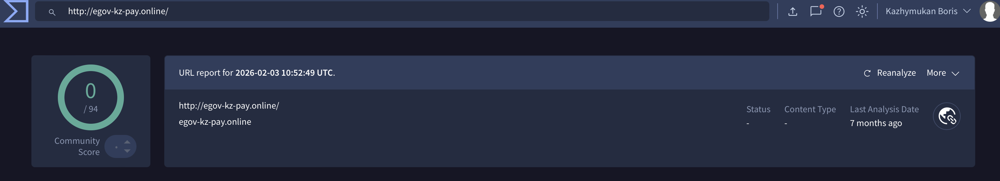
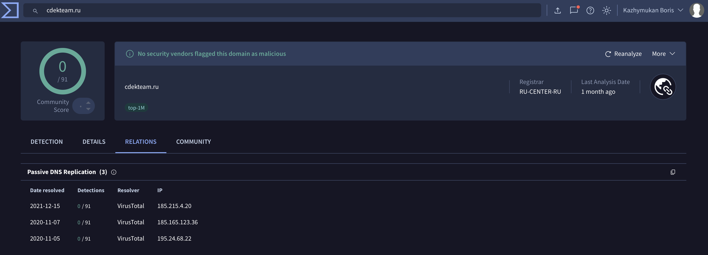
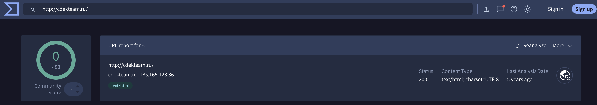
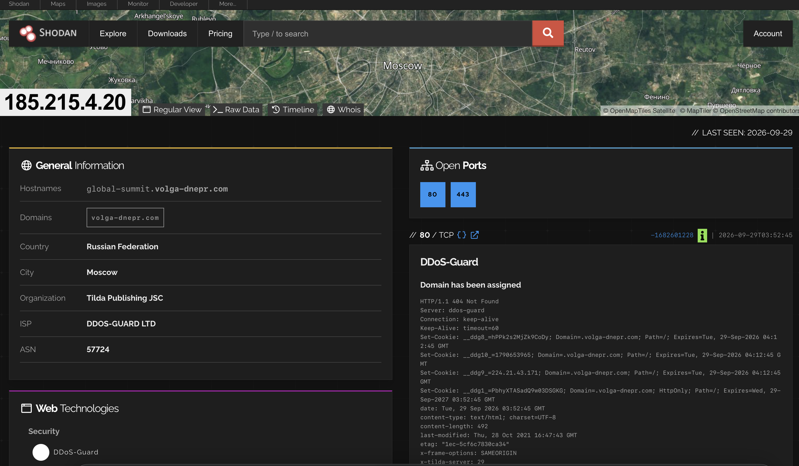
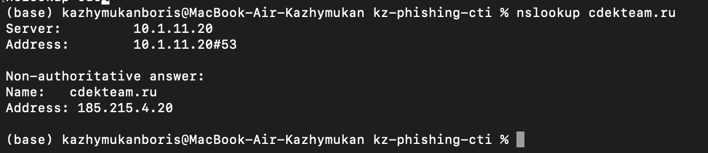
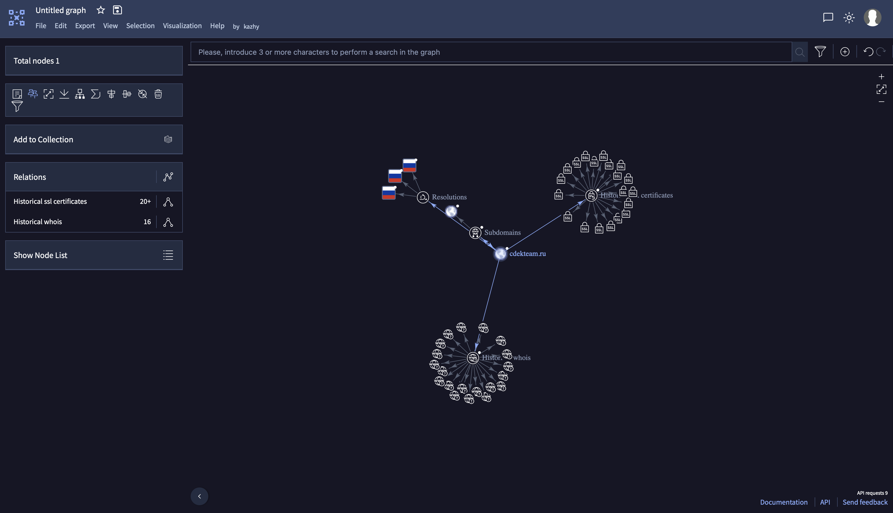
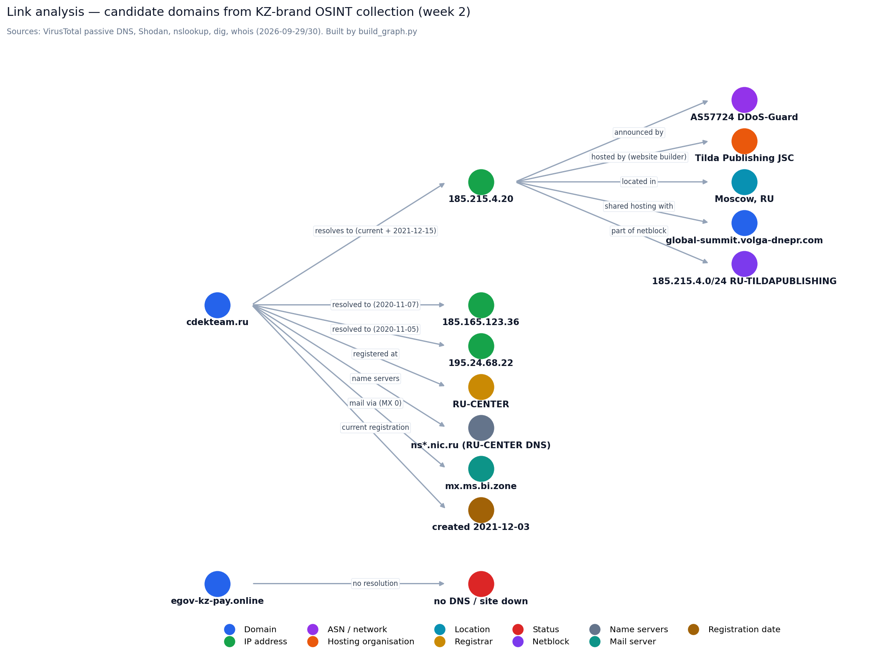

# Week 2 — Data Collection Process

**Group topic:** phishing campaigns impersonating Kazakhstani brands (Kaspi, eGov, Kazpost, CDEK …)

**Syllabus tasks:** (1) perform OSINT data collection using Shodan, VirusTotal and Maltego; (2) develop a data source mapping for analysis.
**Reading:** Michael Bazzell, *Open Source Intelligence Techniques*; OSINT Framework (osintframework.com); SANS whitepapers.
**Performed by:** Kazhymukan Boris (OSINT role) · **Dates:** 2026-09-26 – 2026-09-30

Deliverables:
- This report (methodology, results, observations)
- [`data-source-mapping.md`](data-source-mapping.md) — which source answers which PIR + what each source actually gave us
- [`scripts/`](scripts/) — `collect_feeds.py` (collection), `vt_lookup.py`, `shodan_search.py` (API versions), `build_graph.py` (link-analysis graph)
- [`data/relations.csv`](data/relations.csv) — every relation found, with its evidence source

## How to reproduce

```bash
cd week-02
pip install -r requirements.txt
python3 scripts/collect_feeds.py          # crt.sh + OpenPhish (URLhaus if key in .env)
python3 scripts/build_graph.py            # rebuilds screenshots/w2_link_graph.png from data/relations.csv
# optional, need API keys in .env (copy .env.example):
python3 scripts/vt_lookup.py --limit 20
python3 scripts/shodan_search.py
```

---

## 1. Collection plan

| Step | Tool | Input | Output | Answers |
|---|---|---|---|---|
| 1 | `collect_feeds.py` (OpenPhish, crt.sh; URLhaus optional) | Brand keywords from [`config/brands.json`](config/brands.json) | `data/raw/collected_iocs.csv` (git-ignored) | PIR-1 |
| 2 | crt.sh web UI | `%kaspi%`, `%egov-kz%` | Certificates, issuers | PIR-1 |
| 3 | VirusTotal | Candidate domains | Detection ratio, passive DNS, registrar | PIR-1, PIR-2 |
| 4 | Shodan | IP from VirusTotal | Location, hosting org, ASN, ports | PIR-2 |
| 5 | `dig` / `whois` (terminal) | Candidate domain and its IP | NS, MX, registration date, netblock owner | PIR-2 |
| 6 | Link analysis (VirusTotal Graph + `build_graph.py`; Maltego CE login failed) | Candidate domain | Graph domain → IP → ASN/hosting | PIR-2 |
| 7 | Manual OSINT | KZ-CERT, media | Lures, channels, example domains | PIR-3, PIR-4 |

## 2. Results

### 2.1 Automated collection (script + crt.sh + OpenPhish)

**Run 1** (`--days 30`): 8 indicators — OpenPhish 0, crt.sh 8 (kaspi 1, egov 1, halyk 1, kolesa 5).



All 8 were **false positives**: three were organisation names from certificates (`kaspi bank, jsc`, `jcs halyk bank of kazakhstan`, `protean egov technologies limited`), five were `kolesa-darom.ru` (a Russian tyre shop — "kolesa" = "wheels").



**Fix:** the script now keeps only valid domain names, the look-back window is 90 days, and the Kolesa keyword was narrowed to `kolesa-kz`/`kolesakz`.

**Run 2** (`--days 90`): 5 indicators — 4 × `*.egov.proteantech.in` (Indian e-government vendor, not Kazakhstan), 1 × **`cdekteam.ru`** (only candidate worth checking).



### 2.2 crt.sh — manual search

`%kaspi%` (valid certificates only): every result belongs to Kaspi Bank itself — `kaspi.kz`, `kaspibank.kz`, `cdn-kaspi.kz`. All are **OV certificates from DigiCert** containing `O=Kaspi Bank, JSC`. No look-alike domains were found.

Raw crt.sh output: [`evidence/crtsh_kaspi_results.txt`](evidence/crtsh_kaspi_results.txt)

### 2.3 VirusTotal

| Domain | Detections | Details |
|---|---|---|
| `cdekteam.ru` | **0/91** | Tag *top-1M*, registrar RU-CENTER, passive DNS: `185.215.4.20` (2021-12-15), `185.165.123.36` (2020-11-07), `195.24.68.22` (2020-11-05) |
| `egov-kz-pay.online` | **0/94** | Cited in media as an example of fake eGov "payout" phishing. URL report 2026-02-03: no HTTP response (site already down) |





### 2.4 Shodan

`185.215.4.20` (current IP of `cdekteam.ru`, confirmed by `nslookup` on 2026-09-29):

| Field | Value |
|---|---|
| Location | Moscow, Russian Federation |
| Organization | Tilda Publishing JSC (website builder) |
| ISP / ASN | DDoS-GUARD LTD / AS57724 |
| Open ports | 80, 443 |
| Other hostname on this IP | `global-summit.volga-dnepr.com` (unrelated airline site) |
| HTTP header | `x-tilda-server` |




### 2.5 DNS and WHOIS from the terminal (`dig`, `whois`)

The same lookups Maltego transforms perform, run manually on 2026-09-30:

| Query | Result |
|---|---|
| `dig cdekteam.ru A` | `185.215.4.20` |
| `dig cdekteam.ru NS` | `ns3-l2`, `ns4-l2`, `ns8-l2`, `ns4-cloud`, `ns8-cloud` `.nic.ru` (RU-CENTER DNS) |
| `dig cdekteam.ru MX` | `0 mx.ms.bi.zone`, `10 mx.cdekteam.ru` |
| `whois cdekteam.ru` | Registrar RU-CENTER-RU, **created 2021-12-03**, paid till 2026-12-03, state `REGISTERED, DELEGATED, VERIFIED`, org hidden |
| `whois 185.215.4.20` | Netblock `185.215.4.0/24` (`RU-TILDAPUBLISHING-20210412`), org **Tilda Publishing JSC**, route origin **AS57724**, routes maintained by DDoS-Guard, abuse `legal@tilda.ru` |

Findings:
- WHOIS confirms Shodan: the IP belongs to Tilda's own netblock, announced via DDoS-Guard.
- The **current registration dates from 2021-12-03**, while VirusTotal passive DNS shows the name resolving in 2020 → the domain was registered before, expired, and was **re-registered** in December 2021. It has now been held continuously for almost 5 years.
- Mail goes through `mx.ms.bi.zone` — by its name, the mail-filtering service of BI.ZONE (a Russian cybersecurity company). Setting up corporate mail behind a mail-security gateway is typical for a real organisation, not for throw-away phishing domains.

Full terminal output: [`evidence/dig_whois_output.txt`](evidence/dig_whois_output.txt)

### 2.6 Link analysis (Maltego replacement)

Maltego CE could not be used (login/registration failed). The same analysis was done with **VirusTotal Graph** and a custom graph script (`build_graph.py`) built from the relations above.

VirusTotal Graph for `cdekteam.ru`: 3 resolutions (all RU), 1 subdomain, **20+ historical SSL certificates**, **16 historical WHOIS records**.




### 2.7 Summary table

| Metric | Value |
|---|---|
| Indicators collected (run 1 / run 2) | 8 / 5 |
| — from OpenPhish | 0 |
| — from crt.sh | 8 / 5 |
| — from URLhaus | not used (no API key) |
| Candidates checked manually | 2 (`cdekteam.ru`, `egov-kz-pay.online`) |
| Confirmed live phishing domains | **0** |
| False positives identified | 13 (8 in run 1, 4 `proteantech.in`, 1 `cdekteam.ru`) |
| Hosting of checked candidate | Tilda shared hosting, Moscow, AS57724 |

## 3. Data source mapping (summary)

Full version: [`data-source-mapping.md`](data-source-mapping.md) (PIR matrix, field mapping, data flow, source evaluation).

| Source | Answers | Data taken | Result in our run | Verdict |
|---|---|---|---|---|
| crt.sh | PIR-1 new look-alike domains | domain, cert date, issuer | 13 hits, all false positives; showed Kaspi's real certs (DigiCert OV) | Best for **early discovery**, needs verification |
| OpenPhish | PIR-1 known phishing URLs | URL | 0 KZ-brand URLs | Weak coverage of Kazakhstan |
| VirusTotal | PIR-1 maliciousness, PIR-2 infrastructure | detections, passive DNS, registrar | 0/91 and 0/94 | Best for **verification**, lags behind short-lived phishing |
| Shodan | PIR-2 hosting | location, org, ASN, ports | Tilda shared hosting, Moscow, AS57724 | Good for context; IP alone is a weak indicator |
| VirusTotal Graph / dig / whois (instead of Maltego) | PIR-2 relations | IP, NS, MX, registration date, netblock | Long-lived legit domain, re-registered 2021 | Reproduces Maltego transforms for free |
| KZ-CERT / media | PIR-3 lures, PIR-4 trends | schemes, example domains | Kaspi & eGov most imitated; `egov-kz-pay.online` example | Best **local context**, not machine-readable |

## 4. Observations

1. **Keyword matching alone is not enough.** All 13 automated hits were false positives: generic words ("egov" is used by other countries, "kolesa" means "wheels") and organisation names inside certificates. Verification with other sources is mandatory — this is exactly why week 3 (filtering/normalization, [`../week-03`](../week-03)) is needed.
2. **Certificates tell legitimate and fake sites apart.** Kaspi's real domains use paid OV certificates (DigiCert) with `O=Kaspi Bank, JSC`. Phishing sites usually use free DV certificates (e.g. Let's Encrypt) without an organisation name.
3. **`cdekteam.ru` is a false positive:** 0/91 on VirusTotal, in the top-1M list, continuously registered since 2021-12-03 (name seen in DNS since 2020), 20+ certificate renewals, 16 WHOIS records, and corporate mail behind a mail-security gateway — typical for a long-lived legitimate site (a Tilda landing page), not for phishing that lives days or weeks.
4. **Shared hosting makes IPs weak indicators.** `185.215.4.20` hosts many unrelated Tilda sites; blocking it would cause collateral damage. Domains and certificates are better indicators here.
5. **0 detections does not mean safe.** `egov-kz-pay.online`, cited in media as an eGov phishing example, has 0/94 — the site was already offline when scanned. Reputation services lag behind short-lived phishing.
6. **Global feeds barely cover Kazakhstan.** OpenPhish returned no KZ-brand URLs; local sources (KZ-CERT alerts, bank notifications) are more relevant.

## 5. Limitations

- Only open sources; no access to bank/telecom telemetry or SMS content where most lures are delivered.
- crt.sh only shows domains that obtained a certificate and contain the brand keyword; phishers often avoid the brand name in the domain.
- Maltego CE unavailable → replaced by VirusTotal Graph and a custom graph.
- Free API limits (VirusTotal 4 req/min, Shodan filters need a paid/academic account).

## 6. Input for week 3

- Add `kaspibank.kz`, `cdn-kaspi.kz` to the allow-list (done in [`config/brands.json`](config/brands.json)); the week 3 Sigma rule filter should include them too.
- Add an exclusion for non-KZ "egov" domains (e.g. `*.proteantech.in`) or narrow the keyword to `egov-kz` / `egovkz`.
- Load verified candidates and false positives into MISP with proper tags (`false-positive` vs `to_ids`).
