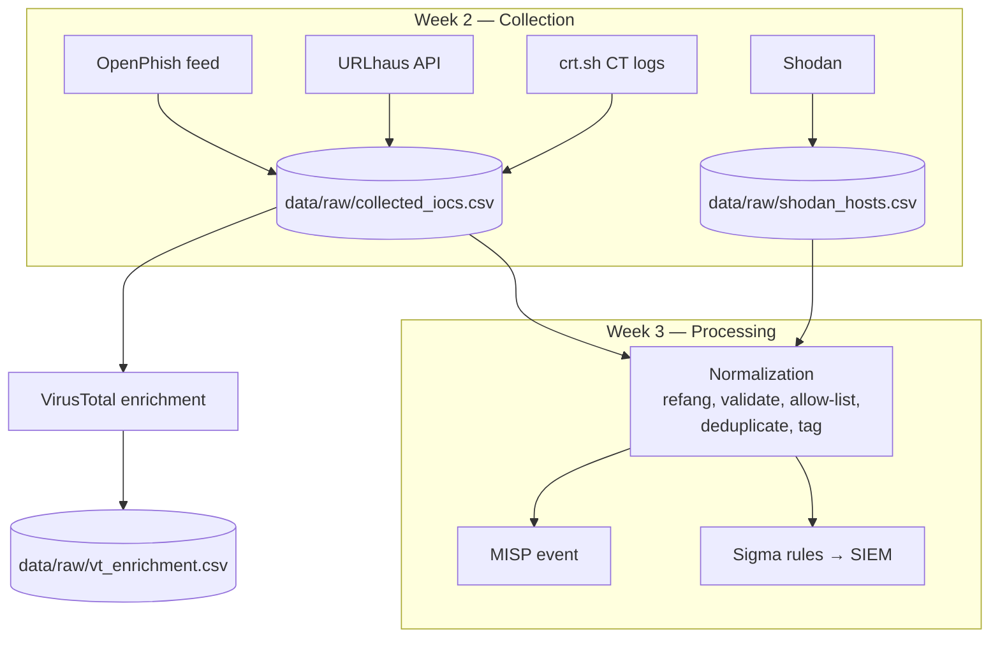

# Data Source Mapping (Week 2)

Goal (syllabus week 2, task 2): show **which data source answers which intelligence requirement**, what fields we take from it, and how it flows into processing (week 3).

## 1. Source → PIR matrix

| Source | PIR-1 Phishing domains/URLs | PIR-2 Infrastructure | PIR-3 Lures & channels | PIR-4 Trends/impact |
|---|:-:|:-:|:-:|:-:|
| OpenPhish | ● | | ◐ | |
| URLhaus | ● | ◐ | | |
| crt.sh (CT logs) | ● | ◐ | | ◐ |
| Shodan | ◐ | ● | | |
| VirusTotal | ● | ● | | |
| Maltego | | ● | | |
| KZ-CERT / MVD / media | | | ● | ● |

● primary source, ◐ supporting source

## 2. Field mapping to a common schema

All collected data is converted to one schema (normalization is done in week 3):

| Common field | OpenPhish | URLhaus | crt.sh | Shodan | VirusTotal |
|---|---|---|---|---|---|
| `indicator` | URL line | `url` | `name_value` | `ip_str` | `id` |
| `type` | url | url | domain | ip | url/domain/ip |
| `first_seen` | time of download | `date_added` | `entry_timestamp` | `timestamp` | `first_submission_date` |
| `brand` | keyword match | keyword match | keyword match | query name | — (inherited) |
| `source` | "openphish" | "urlhaus" | "crt.sh" | "shodan" | "virustotal" |
| enrichment | — | `threat`, `tags` | `issuer_name` | `org`, `asn`, `country` | detections, registrar, ASN |

## 3. Data flow

## 4. Source evaluation

| Source | Timeliness | Coverage for KZ | Cost | Main weakness |
|---|---|---|---|---|
| crt.sh | Minutes after cert issue | High (any TLD) | Free | Many false positives, no maliciousness verdict |
| OpenPhish | Hours | Low–medium (global feed) | Free (community) | Sampled, few KZ brands |
| URLhaus | Hours | Low (malware-focused) | Free key | Not phishing-centric |
| Shodan | Days (scan cycle) | Medium | Free / academic | Filters need membership |
| VirusTotal | On demand | Medium | Free, 4 req/min | New domains often 0 detections |
| KZ-CERT / media | Days–weeks | High for KZ context | Free | Not machine-readable |

## 5. What the sources actually gave us (run of 2026-09-26 … 2026-09-30)

| Source | Result in our collection | Lesson |
|---|---|---|
| OpenPhish | 0 URLs with KZ brands | A global feed barely covers Kazakhstani brands → local sources (KZ-CERT) are needed |
| URLhaus | Not used (no Auth-Key) | Optional; malware-oriented anyway |
| crt.sh (script) | Run 1: 8 hits, all false (organisation names, `kolesa-darom.ru`). Run 2 (fixed filter, 90 days): 5 hits — 4 × `*.egov.proteantech.in` (Indian e-gov vendor), 1 × `cdekteam.ru` | Keyword matching is noisy; "egov" and "kolesa" are generic words |
| crt.sh (manual, `%kaspi%`) | Only Kaspi's own certificates: DigiCert OV, `O=Kaspi Bank, JSC` (`kaspi.kz`, `kaspibank.kz`, `cdn-kaspi.kz`) | Legit brand = paid OV cert with organisation name; phishing usually = free DV cert |
| VirusTotal | `cdekteam.ru` 0/91 (top-1M, registrar RU-CENTER, 3 IPs in passive DNS); `egov-kz-pay.online` 0/94, no HTTP response | 0 detections ≠ safe: short-lived phishing is gone before engines flag it |
| Shodan | `185.215.4.20`: Moscow, Tilda Publishing JSC, DDoS-Guard AS57724, ports 80/443, unrelated site on same IP | Shared hosting → IP is a weak indicator |
| VirusTotal Graph (instead of Maltego) | `cdekteam.ru`: 3 RU resolutions, 1 subdomain, 20+ historical certificates, 16 WHOIS records | Long history = legitimate domain |
| nslookup | `cdekteam.ru` → `185.215.4.20` (2026-09-29) | Confirms passive DNS is still current |
| dig / whois | NS at RU-CENTER, MX via `mx.ms.bi.zone`, registered 2021-12-03 (re-registration), IP in Tilda netblock `185.215.4.0/24`, AS57724 | Free terminal tools reproduce the core Maltego transforms |

**Most useful:** crt.sh for early discovery + VirusTotal/Shodan for verification.
**Least useful for KZ:** OpenPhish community feed.
