# Week 5 — Threat Hunting Concept

**Group topic:** phishing campaigns impersonating Kazakhstani brands (Kaspi, eGov, Kazpost, CDEK …)

**Syllabus tasks:** (1) build a hypothesis-driven hunting scenario (e.g. suspicious PowerShell activity); (2) execute hunt queries in Splunk or ELK.
**Reading:** Microsoft Threat Hunting Guide; Phillip Smith, *Practical Threat Hunting*; SANS Threat Hunting Summit.
**Performed by:** Kazhymukan Boris · **Date:** 2026-10-06

**Structure of the work**
- **Part A (sections 3–9): full hunt on our topic.** Kazakhstani brands, lab logs of a simulated company (DNS, proxy, Sysmon), hypotheses H1–H3, Splunk queries.
- **Part B (section 9): the same H1 hunt on REAL data.** Open feed of 392 164 active phishing domains. Kazakhstani brands first; then, because real KZ data is scarce, global analogs of our brands (as agreed with the instructor).

Deliverables:
- This report (hypotheses, hunt queries, results, conclusions)
- [`scripts/generate_lab_logs.py`](scripts/generate_lab_logs.py): builds the lab dataset (DNS, proxy, Sysmon)
- [`queries/hunt_queries.spl`](queries/hunt_queries.spl) (Splunk) and [`queries/hunt_queries_elk.esql`](queries/hunt_queries_elk.esql) (Elastic)
- [`scripts/hunt.py`](scripts/hunt.py): the same hunt in plain Python, used to cross-check the Splunk results ([`data/hunt_output.txt`](data/hunt_output.txt))
- [`scripts/real_feed_hunt.py`](scripts/real_feed_hunt.py) + [`queries/real_feed_queries.spl`](queries/real_feed_queries.spl) / [`real_feed_queries_elk.esql`](queries/real_feed_queries_elk.esql): Part B on real data; results in [`data/real/`](data/real/)
- [`sigma-rules/`](sigma-rules/): two new detection rules produced by the hunt
- [`SETUP.md`](SETUP.md): how to load the data into Splunk or ELK

## How to reproduce

```bash
cd week-05
python3 scripts/generate_lab_logs.py   # writes data/dns.csv, proxy.csv, sysmon.csv
python3 scripts/hunt.py                # expected results (no Splunk needed)
# then upload data/*.csv to Splunk (see SETUP.md) and run queries/hunt_queries.spl

python3 scripts/real_feed_hunt.py      # Part B: downloads the real feed (~11 MB) and runs the hunt
```

---

## 1. Threat hunting in one paragraph

Detection (SIEM rules, antivirus) is **reactive**: it waits for an alert on something already known. Threat hunting is **proactive**: the analyst assumes the attacker may already be inside without triggering an alert, forms a guess about where that would show up, and searches the data to confirm or reject it. A successful hunt ends with a new detection rule, so the same search runs automatically from then on.

## 2. Two hunting models

| | Intel-driven | Hypothesis-driven |
|---|---|---|
| Starting point | Threat intelligence: IoCs, reports | An assumption about attacker **behaviour** (TTP) |
| Question | "Did anyone touch *this* domain/IP?" | "Is there activity that *looks like* phishing, whatever the domain?" |
| Our input | Week-3 MISP event (`kaspi-bonus-2026.com`, `eg0v-portal.kz`, …) | Week-1 threat model + week-4 Kill Chain/ATT&CK |
| Finds | Only already-known infrastructure | Also **new** infrastructure that no feed has yet |
| Weakness | The attacker changes a domain in minutes | More noise; needs triage |
| Pyramid of Pain | Bottom: domains, IPs | Top: TTPs |

This week we run **both** on the same data to show the difference (section 6).

## 3. Part A data: why lab logs

Our group has no real corporate network. Week-2 OSINT also showed that live, confirmed Kazakhstani phishing domains are hard to catch in open sources: every crt.sh/OpenPhish candidate was a false positive. So, as is usual for training hunts, we **simulated one week of logs** of a small company:

| Item | Value |
|---|---|
| Company | "QazLogistics LLP" (fictitious), 24 Windows workstations `WS-000`…`WS-023` |
| Period | 2026-09-28 … 2026-10-04, Asia/Almaty |
| Logs | `dns.csv` (4 319 events), `proxy.csv` (4 318), `sysmon.csv` (321: Event ID 1 process creation, Event ID 3 network) |
| Background | Office traffic: Google, Microsoft 365, Telegram **and the official** kaspi.kz, egov.kz, post.kz, cdek.kz, homebank.kz |
| Real noise from week 2 | `cdekteam.ru`, `egov.proteantech.in`, `kolesa-darom.ru`: real false positives our OSINT met |
| Benign admin PowerShell | nightly `inventory.ps1`, plus an IT agent (ManageEngine) that runs `-EncodedCommand` 30 times |
| Planted attacks | 1 known MISP IoC, 5 **new** look-alike domains, 1 "Kazpost" macro attachment (section 4) |

Except `kaspi-bonus-2026.com` (our week-3 IoC), all malicious domains are invented, and their IPs come from the RFC 5737 documentation ranges. The "malicious" PowerShell command is base64 of a harmless placeholder text, so the dataset contains no working attack.

## 4. Hypotheses

Each hypothesis follows the hunting loop **hypothesis → data → query → findings → rule**.

### H1. Brand look-alike domains (main hypothesis)

> **"Users of our network are resolving domains that imitate Kazakhstani brands (Kaspi, eGov, Kazpost, CDEK, Halyk) but do not belong to them."**

- **Why we believe it:** week 1. Fraudsters register domains such as `kaspi-…`, `egov-vyplata…`, `kazpost-…` and send links by SMS/WhatsApp/Telegram.
- **ATT&CK:** T1583.001 Acquire Infrastructure: Domains → T1566.002 Phishing: Spearphishing Link
- **Data:** DNS resolver log (`query`, `hostname`, `user`)
- **Logic:** domain contains a brand keyword **AND** is not an official domain or its subdomain
- **Confirmed if:** a domain appears that is not an official brand domain and not a known benign site

### H2. Credentials were actually submitted

> **"After opening a look-alike site, the user sent data to it (HTTP POST: login form, card, SMS code)."**

- **ATT&CK:** T1056.003 Input Capture: Web Portal Capture
- **Data:** web proxy log (`method`, `domain`, `url`, `bytes_out`)
- **Logic:** `method = POST` to an H1 domain
- **Why:** H1 shows who *visited*; H2 shows who **became a victim** and needs a password reset or card block

### H3. Suspicious PowerShell after a "Kazpost" attachment (syllabus example)

> **"A fake 'Kazpost / CDEK parcel notification' email with a macro document made Word start PowerShell."**

- **ATT&CK:** T1566.001 Spearphishing Attachment → T1204.002 User Execution: Malicious File → T1059.001 PowerShell
- **Data:** Sysmon Event ID 1 (`image`, `parent_image`, `command_line`) and Event ID 3 (network)
- **Logic:** `powershell.exe` whose parent is `WINWORD/EXCEL/OUTLOOK/POWERPNT.EXE`
- **Note:** we deliberately do **not** hunt on "`-enc` = bad"; H3b checks how noisy that would be

### H0. Intel-driven baseline (for comparison)

> "Did anyone resolve an indicator from our week-3 MISP event?"

## 5. Hunt queries and results

All queries: [`queries/hunt_queries.spl`](queries/hunt_queries.spl). Results below come from [`data/hunt_output.txt`](data/hunt_output.txt) and match Splunk.

> **Where these were run:** this assignment was executed via **Option B — Elastic (ELK) in Docker on a Mac (Apple silicon, M2)**. The data was loaded into indices `th-dns`, `th-proxy`, `th-sysmon`, `th-real` and every block was run in **Kibana → Discover → ES|QL** ([`queries/hunt_queries_elk.esql`](queries/hunt_queries_elk.esql) for H0–H3b, [`queries/real_feed_queries_elk.esql`](queries/real_feed_queries_elk.esql) for R0–R4). All screenshots below are the `w5_elk_*.png` files in [`screenshots/`](screenshots/); the numbers are identical to Splunk.

### H0. Intel-driven: MISP indicators

```spl
index=th_lab sourcetype=lab_dns
    (query IN ("kaspi-bonus-2026.com", "eg0v-portal.kz", "kazpost-delivery-track.net")
     OR answer IN ("185.120.10.45", "193.100.20.15"))
| table _time hostname user query answer
```

| Time | Host | User | Domain | IP |
|---|---|---|---|---|
| 2026-09-29 11:42 | WS-007 | l.sadykova | kaspi-bonus-2026.com | 185.120.10.45 |

**1 hit.** The IoC-based search works, but it can only find what we already knew.

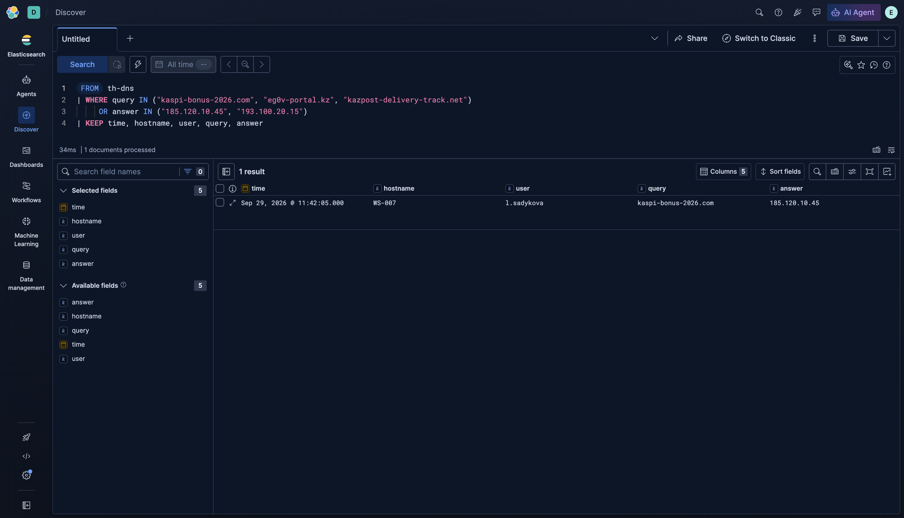

### H1. Look-alike domains

```spl
index=th_lab sourcetype=lab_dns
    (query="*kaspi*" OR query="*egov*" OR query="*kazpost*" OR query="*post.kz*"
     OR query="*cdek*" OR query="*halyk*" OR query="*homebank*")
| eval official=if(match(query, "(^|\.)(kaspi\.kz|kaspibank\.kz|cdn-kaspi\.kz|egov\.kz|gov\.kz|post\.kz|kazpost\.kz|cdek\.kz|cdek\.ru|halykbank\.kz|homebank\.kz)$"), 1, 0)
| where official=0
| stats count dc(hostname) AS hosts values(hostname) AS host_list earliest(_time) AS first_seen BY query
```

| Domain | Requests | Hosts | First seen | Verdict |
|---|---|---|---|---|
| `cdekteam.ru` | 3 | 3 | 09-29 10:00 | **False positive**: checked in week 2 (Tilda site, 0/91 on VT) |
| `kaspi-bonus-2026.com` | 1 | 1 (WS-007) | 09-29 11:42 | Malicious: known MISP IoC |
| `kaspi-gold-bonus.top` | 4 | 1 (WS-012) | 09-30 11:24 | **Malicious: NEW** |
| `kazpost-notice.site` | 1 | 1 (WS-021) | 09-30 14:05 | **Malicious: NEW** (see H3) |
| `egov.proteantech.in` | 3 | 3 | 09-30 15:04 | **False positive**: Indian e-gov vendor (week 2) |
| `egov-vyplata.online` | 2 | 1 (WS-015) | 10-01 11:16 | **Malicious: NEW** |
| `kazpost-posylka.site` | 2 | 1 (WS-019) | 10-01 12:23 | **Malicious: NEW** |
| `cdek-dostavka-kz.info` | 1 | 1 (WS-004) | 10-02 10:11 | **Malicious: NEW** |

**8 look-alike domains: 6 malicious (5 unknown to MISP) + 2 false positives.**
Triage signs that separate them: phishing domains use cheap TLDs (`.top`, `.online`, `.site`, `.info`), were seen by **one** host only and appear once or twice. The false positives are on several hosts and were already checked during week-2 OSINT. Note that the official `kaspi.kz`, `pay.kaspi.kz`, `idp.egov.kz` and `track.post.kz` correctly **did not** appear, and `kolesa-darom.ru` was not matched because the keyword list was narrowed in week 2.

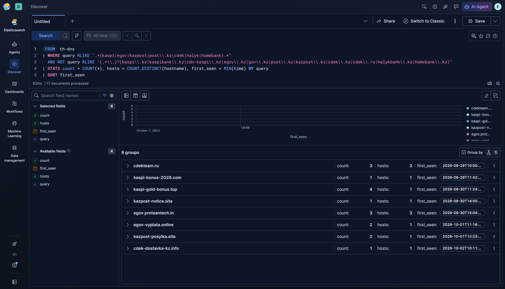

### H2. Data submitted to a look-alike site

```spl
index=th_lab sourcetype=lab_proxy method=POST
    (domain="*kaspi*" OR domain="*egov*" OR domain="*kazpost*" OR domain="*cdek*" OR domain="*halyk*")
| where NOT match(domain, "(^|\.)(kaspi\.kz|kaspibank\.kz|egov\.kz|gov\.kz|post\.kz|kazpost\.kz|cdek\.kz|cdek\.ru|halykbank\.kz|homebank\.kz)$")
| table _time hostname user method url bytes_out
```

| Time | Host | User | POST to | Interpretation |
|---|---|---|---|---|
| 09-30 11:25 | WS-012 | s.aitkulova | `kaspi-gold-bonus.top/login/verify` | Kaspi login + password |
| 09-30 11:30 | WS-012 | s.aitkulova | `kaspi-gold-bonus.top/sms/confirm` | **SMS/OTP code**: enough to take over the account |
| 10-01 11:17 | WS-015 | v.sokolova | `egov-vyplata.online/posobie/card` | Card data for a fake "benefit payout" |
| 10-01 12:24 | WS-019 | b.karimova | `kazpost-posylka.site/pay` | Card data for a fake "delivery fee" |

**3 victims.** WS-004 opened `cdek-dostavka-kz.info` but did **not** submit anything (GET only): exposed, not compromised.

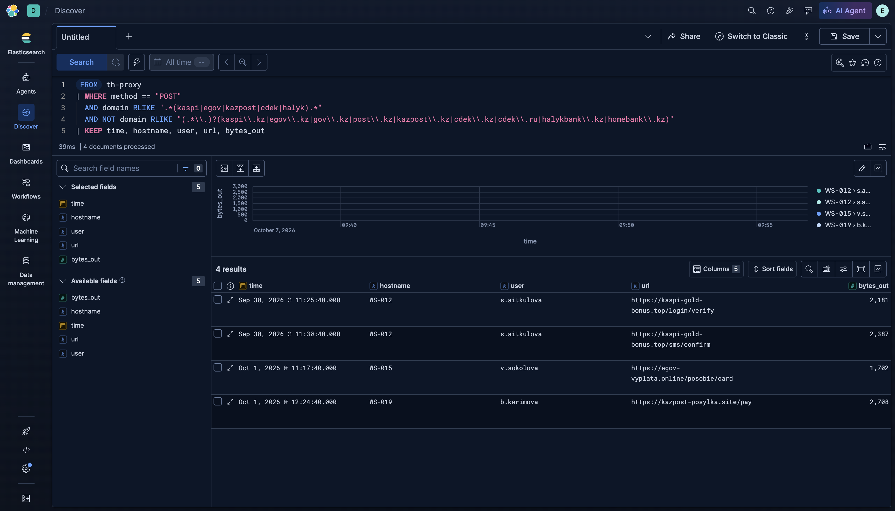

### H3. PowerShell spawned by Office

```spl
index=th_lab sourcetype=lab_sysmon event_id=1 image="*\\powershell.exe"
    (parent_image="*\\WINWORD.EXE" OR parent_image="*\\EXCEL.EXE"
     OR parent_image="*\\OUTLOOK.EXE" OR parent_image="*\\POWERPNT.EXE")
| table _time hostname user parent_image command_line
```

**1 hit: WS-021 (e.sultanov), 2026-09-30 14:05.** Reconstructed chain:

```
14:05:10  OUTLOOK.EXE → WINWORD.EXE  "...\Temp\Kazpost_Uvedomlenie_4471.docm"   (macro document from email)
14:05:22  WINWORD.EXE → powershell.exe -nop -w hidden -enc <base64>              (hidden, encoded)
14:05:23  DNS  kazpost-notice.site → 203.0.113.99                                 (same domain H1 found)
14:05:24  powershell.exe → 203.0.113.99:443                                       (download / C2)
```

H3 and H1 **confirm each other**: the PowerShell connects to `kazpost-notice.site`, which H1 found independently in DNS.

**H3b. Why not simply hunt for `-enc`?**

```spl
index=th_lab sourcetype=lab_sysmon event_id=1 image="*\\powershell.exe" command_line="* -enc*"
| stats count dc(hostname) AS hosts BY parent_image
```

| Parent process | Encoded PowerShell runs |
|---|---|
| `ManageEngine\UEMS_Agent\dcagentservice.exe` (IT agent) | 30 |
| `WINWORD.EXE` | **1** |

A rule on `-enc` alone would give **30 false alarms for 1 real event**. The **parent process** is what makes the behaviour suspicious: Word has no reason to start PowerShell.

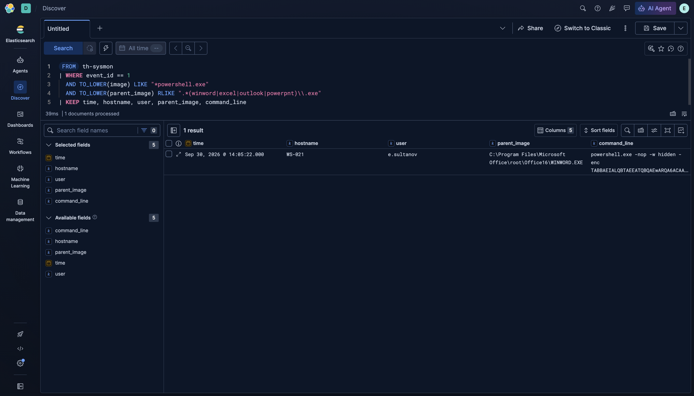

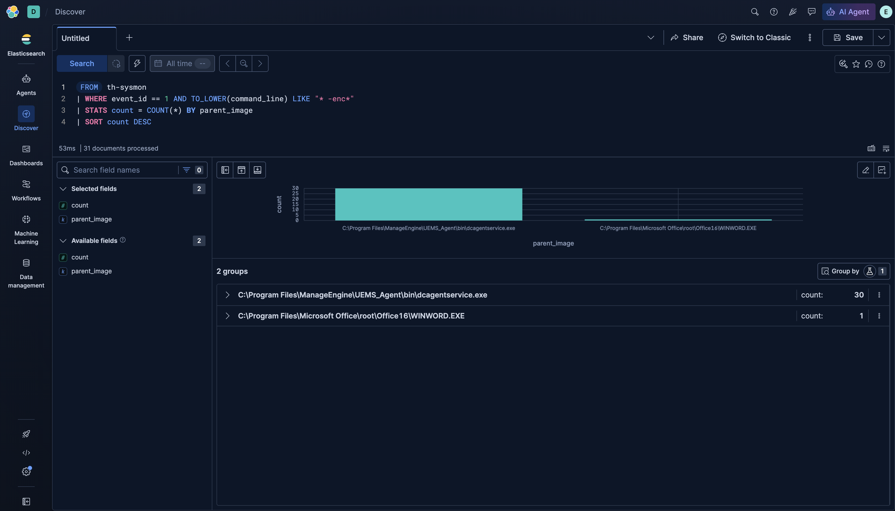

## 6. Intel-driven vs hypothesis-driven: result

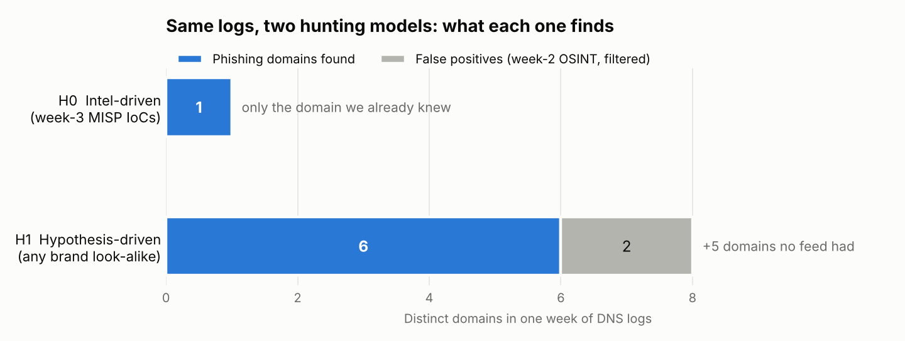

| | H0 (intel) | H1–H3 (hypothesis) |
|---|---|---|
| Malicious domains found | 1 | 6 |
| Victims who submitted data | 0 found | 3 (WS-012, WS-015, WS-019) |
| Infected hosts | 0 found | 1 (WS-021) |
| False positives to triage | 0 | 2 domains (both already known from week 2) |

The IoC search missed **5 of 6** malicious domains and **all** compromised users. The attacker simply registered new domains. The behavioural hypotheses caught them at the cost of 2 easy-to-explain false positives.

## 7. Response (what the SOC would do)

| Host / user | Finding | Action |
|---|---|---|
| WS-012 s.aitkulova | Kaspi login + OTP submitted | Tell the user to change the Kaspi password and contact the bank; check for unauthorized transactions |
| WS-015 v.sokolova, WS-019 b.karimova | Card data submitted | Block/reissue cards via the bank |
| WS-021 e.sultanov | Macro → PowerShell → 203.0.113.99 | Isolate host, collect memory/disk, reimage; search for 203.0.113.99 on other hosts |
| WS-004 | Opened phishing page, no POST | Awareness reminder |
| All | 5 new domains, 1 new IP | Block at DNS/proxy; **add to the MISP event** (week 3) so H0 catches them next time |

This closes the intelligence cycle: hunting results feed back into CTI.

## 8. Hunt → detection (new Sigma rules)

| Rule | From hunt | Improves on |
|---|---|---|
| [`rule-002-kz-brand-lookalike-dns.yml`](sigma-rules/rule-002-kz-brand-lookalike-dns.yml) | H1 + Part B | Week-3 `rule-001` listed 3 fixed domains. The new rule matches **any** brand look-alike, with an allow-list of official domains and week-2 false positives. Its regex was tuned on real data (section 9) |
| [`rule-003-office-spawns-powershell.yml`](sigma-rules/rule-003-office-spawns-powershell.yml) | H3 | New: keyed on parent process, not `-enc` (H3b) |

Both rules were validated by converting them with pySigma (`sigma convert -t splunk`).

## 9. Part B: H1 on real data

Part A proves the method on lab logs. Part B checks the H1 logic (brand look-alike domains) on **real** phishing infrastructure. Following the instructor's guidance, we hunt for **Kazakhstani brands first** and only then, because real KZ data turned out to be scarce, for **global analogs** of our brands.

### 9.1 Data source

| Item | Value |
|---|---|
| Source | [Phishing.Database](https://github.com/Phishing-Database/Phishing.Database): open, community-maintained feed of **active** phishing domains |
| File | `phishing-domains-ACTIVE.txt`, snapshot from commit `12a20bf` (2026-10-02) |
| Size | **392 164** unique domains |
| What it is NOT | Not company logs: it shows phishing *infrastructure*, not who visited it. So only H1 can be run on it; H2 (who submitted data) and H3 (PowerShell) need endpoint/proxy logs and stay in Part A |
| How to load | `python3 scripts/real_feed_hunt.py` downloads the feed and writes `data/real/feed_for_splunk.csv` → upload to Splunk as `index=th_real sourcetype=real_feed` → queries in [`queries/real_feed_queries.spl`](queries/real_feed_queries.spl) |

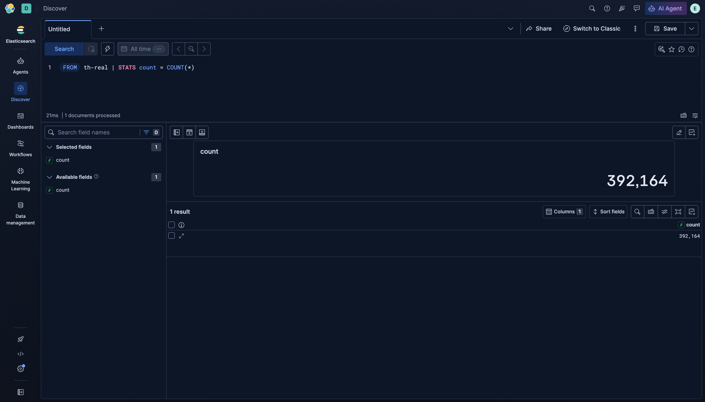

### 9.2 Step 1: Kazakhstani brands

Keywords and official domains are reused from week 2 ([`week-02/config/brands.json`](../week-02/config/brands.json)): Kaspi, eGov, Halyk, Kazpost, CDEK, OLX.kz, Kolesa, Krisha, Forte, Jusan.

**Naive rule (`domain contains keyword`, the logic of rule-002 in Part A): 214 hits, almost all noise.**

| Keyword | Real examples it matched | Why it is noise |
|---|---|---|
| `egov` | `advanced.thegovuk.com`, `aktiftalep-turkiyegovtr.com` | part of "the**gov**uk", "turkiye**gov**tr" |
| `1414` (eGov call centre) | `341231543214142523.com`, `41414att.weebly.com` | random digits |
| `olx` | `7ymjolxfafr005e4.qwo231sdx.club` | random letters |
| `homebank` | `argenta-homebanking.xyz`, `citibanamex-homebanking.firebaseapp.com` | "homebanking" is a generic word, other banks |

**Refined rule: the keyword must *start a label*** (domain split on `.` and `-`): `(^|[.-])(kaspi|egov|kazpost|cdek|olxkz|…)`. Result: **14 hits**, triaged manually ([`data/real/kz_hits.csv`](data/real/kz_hits.csv)):

| Verdict | Domain | Reason |
|---|---|---|
| **PHISHING (Kaspi)** | `kaspibank.auth-telegramm.ru` | "kaspibank" + fake Telegram "auth" page on a .ru host |
| **PHISHING (Kaspi)** | `kaspiy-delfin.tarho05.ru` | Kaspi-like label on a throw-away .ru subdomain |
| **PHISHING (Kaspi)** | `kaspl.ga` | Typosquat kaspi → kas**pl** (i → l) on a free .ga TLD; `kaspl` was already in our week-2 keyword list |
| **PHISHING (OLX.kz)** | `olxkz.pay-sacure4ds.ru` | Fake "3-D Secure" payment page for OLX Kazakhstan sellers ("pay", misspelt "sacure 4ds") |
| Unclear | `cdekbefotlfzxyqk-dot-millinium.ey.r.appspot.com` | Random App Engine label that happens to start with "cdek" |
| Not our brand | `homebank-argenta.be`, `ing.be.homebank.quarantainezone-omgeving.online` | Real phishing, but of Belgian banks' "homebank", not Halyk |
| False positive (7) | `krishakg2006.github.io` …, `krishayinfotech.com`, `…jusang425.workers.dev` | Personal names "Krisha/Krishan", Cloudflare account "jusang" |

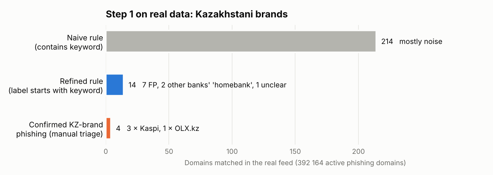

**Result of step 1:** the hypothesis is **confirmed on real data**. Phishing of Kaspi and OLX.kz exists in the wild, including a typosquat and a fake 3-D Secure page, the same lures as in our week-1 threat model. But **4 domains are too few** to draw statistics, and eGov, Kazpost, CDEK and Halyk had **zero** confirmed hits in this feed (consistent with week 2, where crt.sh/OpenPhish gave only false positives).

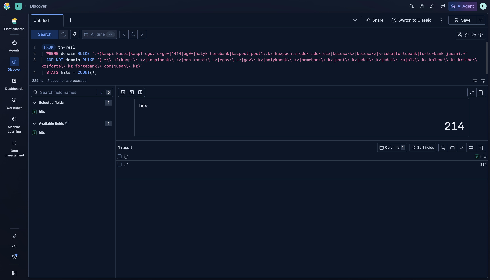

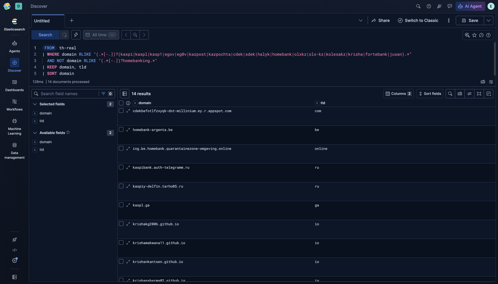

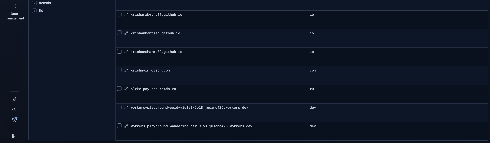

### 9.3 Step 2: global analogs of our brands

Same refined rule, applied to brands that play the **same role** abroad:

| Global brand | KZ analog | Naive | **Refined** | Typical real examples |
|---|---|---|---|---|
| USPS | Kazpost (national post) | 1 621 | **1 313** | `my-package-usps-mover-guide.mrbasic.com`, `usps-parcel.com` |
| PayPal | Kaspi (payments) | 1 122 | **1 078** | `account-paypal-secure.net`, `au-paypalverify.com` |
| DHL | Kazpost / CDEK (delivery) | 505 | **404** | `check.dhl-trackinged.com`, `confirm-package-redelivery-dhll.vercel.app` |
| OLX abroad (PL, UA, BG, PT, RO) | OLX.kz | 103 | **55** | `olx-pl.3dsecure-pay.com`, `olx-paygate.site`, `olx-ua.dostavvka-3ds.icu` |
| Gosuslugi (Russia) | eGov (gov portal) | 19 | **16** | `gosuslugi-pay.ru`, `gosuslugi-covid-qr.ru` |

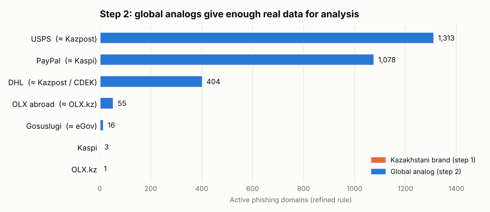

Full list: [`data/real/global_hits.csv`](data/real/global_hits.csv) (2 866 domains).

**What the real data tells us:**
1. **The lures match our KZ scenarios exactly.** Delivery brands (USPS, DHL) are phished with "parcel / track / redelivery" pages, the same story as our lab `kazpost-posylka.site`. OLX is phished with fake "3-D Secure / payment / delivery" pages in every country, and we saw the same scheme for OLX.kz in step 1.
2. **Cheap TLDs are a real triage signal.** Across the 2 866 global hits the top TLDs are `.top` (968), `.com` (606), `.cc` (215), `.ru` (92); USPS phishing alone uses `.top` in 930 of 1 313 cases. This supports the triage rule we used in Part A (`.top`, `.online`, `.site` = suspicious).
3. **The refined regex scales.** On ~392 000 real domains it reduced KZ noise from 214 to 14 hits while keeping every real Kaspi/OLX.kz phishing domain, so we moved it into rule-002.

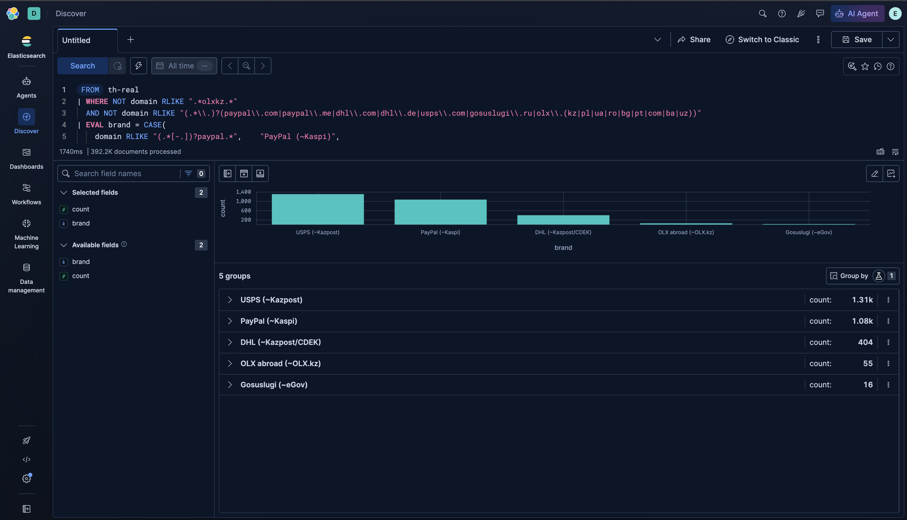

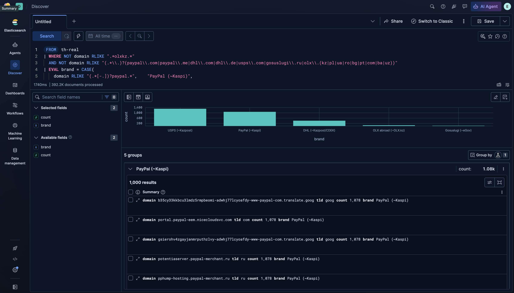


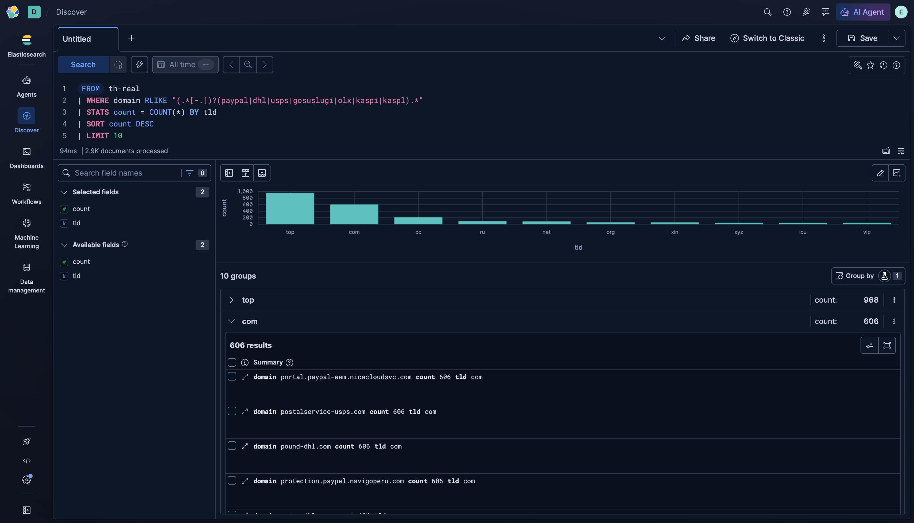

### 9.4 Part A vs Part B

| | Part A (lab logs) | Part B (real feed) |
|---|---|---|
| Data | Simulated DNS, proxy, Sysmon of one company | 392 164 real active phishing domains |
| Hypotheses tested | H0, H1, H2, H3 | H1 only (no endpoint/proxy logs in a feed) |
| KZ brands | 6 phishing domains (planted) | 4 real (3 Kaspi, 1 OLX.kz) |
| Global brands | — | 2 866 real (PayPal, USPS, DHL, OLX, Gosuslugi) |
| Main lesson | Behaviour finds what IoCs miss | "Contains keyword" is too noisy on real data; label-start rule works |

## 10. Conclusions

1. A hunt starts from a **testable hypothesis** tied to ATT&CK and to a concrete log source, not from a vague "we might be hacked".
2. **Intel-driven** hunting is fast but limited to known indicators: it found 1 of 6 domains here.
3. **Hypothesis-driven** hunting on behaviour (brand name in a non-official domain; Office → PowerShell) found new infrastructure, real victims and an infected host.
4. Our **week-2 OSINT paid off**: the false positives we investigated then (`cdekteam.ru`, `egov.proteantech.in`) could be explained immediately.
5. Hypotheses support each other: H1 (DNS) and H3 (process) pointed to the same `kazpost-notice.site`.
6. Every successful hunt should end in a rule (rule-002, rule-003) and in new IoCs for MISP.
7. **Real data (Part B) confirmed the hypothesis** for Kaspi and OLX.kz, but KZ-brand phishing is rare in open feeds (4 of 392 164 domains). Global analogs (PayPal, USPS, DHL, OLX, Gosuslugi; 2 866 domains) use the same lures and confirmed our triage signals.
8. **Real data improved the rule:** "contains keyword" gave 214 hits on real domains, mostly noise; "label starts with keyword" gave 14. A rule that looks fine on clean lab data can fail on real data, so it must be tested on both.

**Limitations:** Part A uses lab data, not production traffic; Part B uses a phishing feed, which shows infrastructure but not victims, so H2/H3 could not be tested on real data. The keyword approach does not catch look-alikes without the brand word (e.g. homoglyphs such as `kаspi` with a Cyrillic "а"). Next step: add an edit-distance / punycode check.
